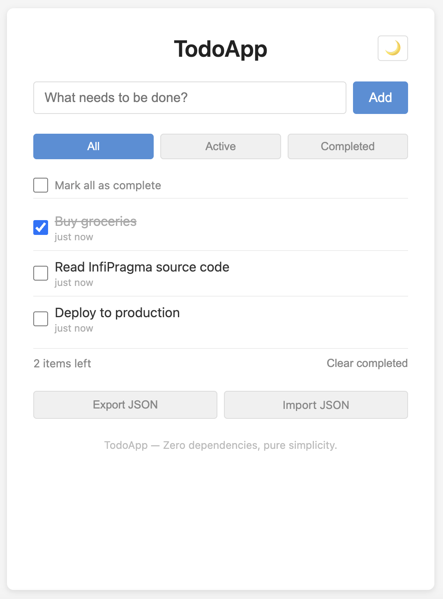
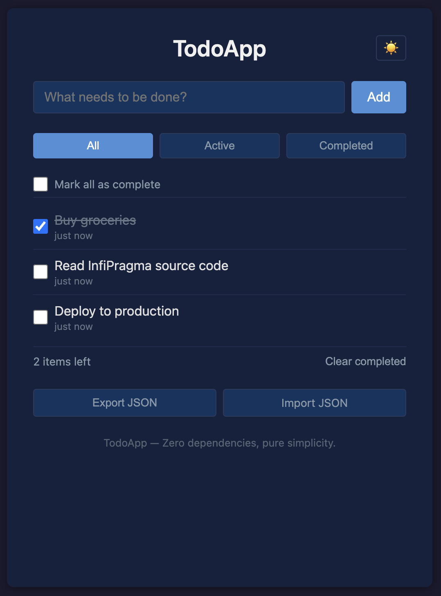

# InfiPragma

**One idea in. One product out.**

You have an idea. You don't want to research the market. You don't want to pick a tech stack. You don't want to write code, write tests, run QA, or figure out deployment. You just want the product.

InfiPragma does all of that — autonomously. Market research, architecture design, feature planning, implementation, E2E testing, quality assurance, deployment. From a single sentence to a working, differentiated product demo. No manual steps in between.

**No Python. No framework. No SDK. Markdown is all you need.**

The entire system is 13 `.md` files. Each one is a specialized agent — written in plain English, readable by anyone, editable with any text editor. A short bash script chains them together. That's the whole thing.

---

## Live Demo

**Try it yourself: [https://jaycheng113.github.io/InfiPragma/](https://jaycheng113.github.io/InfiPragma/)**

This todo app was built entirely by InfiPragma from two lines of config:

```yaml
idea: "A simple todo list web app with add, complete, and delete tasks"
hints: "use vanilla HTML/CSS/JS, no framework, single page"
```

Nobody researched competitors. Nobody designed the architecture. Nobody wrote the code. Nobody wrote the tests. Nobody ran QA. Nobody deployed it. InfiPragma did all of it.

<p align="center">
  
  
</p>

### What InfiPragma Delivered

**Market research** — before writing any code, it analyzed 5 competitors (Todoist, Microsoft To Do, TickTick, Google Tasks, TodoMVC), identified opportunity gaps, and positioned the product as "independent + minimal — the only todo app that works by opening a single HTML file." ([full analysis](examples/todoapp/MARKET.md))

**25 features across 3 tiers** — not just CRUD, but filters, inline editing, drag-and-drop, JSON export/import, dark mode, CSS animations, full accessibility (ARIA + screen reader), responsive design, print styles, and more. Each feature was prioritized by dependency order and categorized as core/enhanced/polish.

**25 Puppeteer E2E tests** — one per feature, all written and validated automatically. Lighthouse scores: Performance 100 / Accessibility 96 / Best Practices 100 / SEO 90.

**3 source files, zero dependencies** — `index.html` (59 lines), `style.css` (685 lines), `app.js` (511 lines). No npm. No framework. No build step.

### How It Got There

| What | Who Did It | How Long |
|------|-----------|----------|
| Market research & competitive analysis | InfiPragma (S1) | 1 session |
| Architecture & tech stack selection | InfiPragma (S2) | 1 session |
| Feature design (25 features, prioritized) | InfiPragma (S3) | 1 session |
| Project scaffold + dev environment | InfiPragma (S4) | 1 session |
| Implementation + E2E tests (25 features) | InfiPragma (S5) | 25 sessions |
| QA (regression, Lighthouse, security) | InfiPragma (S6) | 1 session |
| Deployment | InfiPragma (S7) | 1 session |
| Quality gate reviews | InfiPragma Judge | 8 reviews, avg 9.0/10 |
| **Total** | **47 sessions, 0 human intervention** | |

**Full output: [`examples/todoapp/`](examples/todoapp/)** — every file InfiPragma generated, including [session logs](examples/todoapp/.infipragma/memory/sessions/), [judge reports](examples/todoapp/JUDGE-REPORT.yaml), [feature list](examples/todoapp/feature_list.json), [architecture docs](examples/todoapp/.ai/core/architecture.md), [323-line progress log](examples/todoapp/PROGRESS.md), and the product itself.

---

## How to Use

```bash
git clone https://github.com/JayCheng113/InfiPragma.git
cd InfiPragma
```

Open Claude Code and start talking:

```
You:    I want to build a personal finance tracker that categorizes
        expenses and shows monthly trends. Web app, mobile-friendly.

Claude: Let me understand your idea better...
        [asks clarifying questions, discusses trade-offs, refines the spec]

You:    Looks good, let's build it. Run ./infipragma.sh

Claude: [executes the pipeline, autonomously delivers the product]
```

**You bring the idea. InfiPragma handles the research, development, testing, and deployment.**

Running through Claude Code is recommended — when the pipeline hits issues (a test fails, a dependency breaks, an agent produces incomplete output), Claude Code diagnoses and fixes it on the fly. You don't debug. You don't intervene. You plan.

### Prerequisites

- [Claude Code](https://docs.anthropic.com/en/docs/claude-code) CLI
- `ANTHROPIC_API_KEY` in your environment
- `yq` (`brew install yq`)

> **Warning**: A full pipeline run consumes a significant amount of tokens (47+ sessions, each with multiple tool calls). **Claude Pro or Max plan is strongly recommended.** API usage without a subscription plan may result in high costs.

---

## How It Works

```
Your Idea
   |
   v
+------------------------------------------------------+
|                   infipragma.sh                       |
|                                                       |
|  Read registry.yaml -> Pick .md agent -> claude -p    |
|                                                       |
|  S0 Init -> S1 Research -> S2 Stack -> S3 Design      |
|      |          |            |            |            |
|    Judge      Judge        Judge        Judge          |
|                                                       |
|  S4 Scaffold -> S5 Build -> S6 QA -> S7 Deploy        |
|      |            |           |          |             |
|    Judge        Judge       Judge      Judge           |
+------------------------------------------------------+
   |
   v
Deployed Product (with market research, tests, docs)
```

Every stage must pass a judge review (score 7+/10) before the pipeline advances. The judge is also a `.md` file.

### What's Inside an Agent?

Plain English. No code, no config schema. Here's the essence of `infipragma-build.md`:

```markdown
## Task
Implement one feature per session using a build-test loop.

### Step 2 — Select next feature
- Read feature_list.json.
- Find the highest-priority feature where passes is false.

### Step 5b — Error feedback loop
- Write the error to .infipragma/memory/errors/{error-id}.md
- Check errors/ for similar past errors
- If found: apply the documented fix approach
- If new: diagnose, fix, document for future reference

## Hard rules
- NEVER implement more than ONE feature per session.
- NEVER set passes=true without E2E test confirmation.
```

Want to change how builds work? Edit the text. That's it.

---

## Why `.md`?

| System | Agent Defined By | To Modify It |
|--------|-----------------|--------------|
| OpenHands | Python classes + event handlers | Write Python |
| SWE-agent | Python + ACI config | Write Python |
| AI Scientist | Python pipeline | Write Python |
| Devin | Closed source | You can't |
| **InfiPragma** | **`.md` files** | **Edit text** |

Every other autonomous agent system requires you to be a developer to understand, modify, or debug it. InfiPragma requires a text editor. The `.md` file IS the agent — readable by anyone, version-controlled in git, and completely decoupled from any runtime or model.

---

## Current Status

The core pipeline (13 agent `.md` files + orchestrator) is functional and proven end-to-end.

The following features exist in `infipragma.sh` but are **not yet validated**:

| Feature | Status |
|---------|--------|
| Webhook notifications | Code exists, not tested |
| Budget tracking / cost limits | Code exists, not tested |
| Docker sandbox (`--sandbox`) | Dockerfile exists, not tested |
| Git rollback on judge failure | Tags created, rollback not tested |
| Crash recovery | Lock file logic exists, not tested |

These are secondary — the `.md` content that guides Claude Code is the product. The bash script is just glue.

---

## Inspired By

[Claude Code Superpowers](https://github.com/obra/superpowers) — where `.md` files turn Claude Code into a disciplined engineer. InfiPragma asks: what if the entire product delivery process was a set of skills?

## License

MIT
